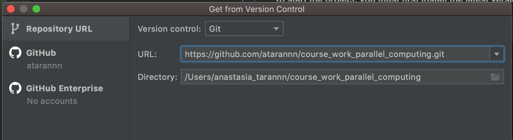

# course_work_parallel_computing
**Client-server program for building an inverted index and for using it.**
____
## Building 
To start the project, you must  **install the latest version** of **Intellij IDEA**.
> [links](https://www.jetbrains.com/idea/) to install Intellij IDEA

### Get a project from version control
1. go to the main menu in Intellij IDEA;
2. select **File**;
3. click **New project from Version Control**;
4. enter the repository URL
  
5. click **Clone**, then click **Yes** in the confirmation dialog;
6. as a result you will have a cloned project.

### After cloning a project to the Intellij IDEA you need to add build configurations.
____
## Features of the project
    The main feature of this project is that you can index files.